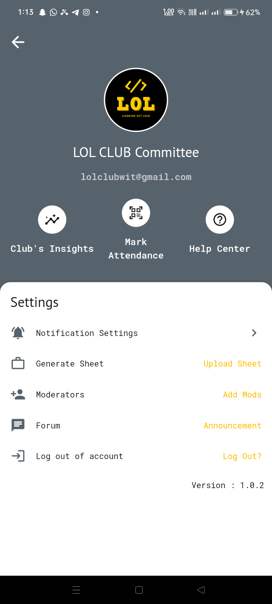
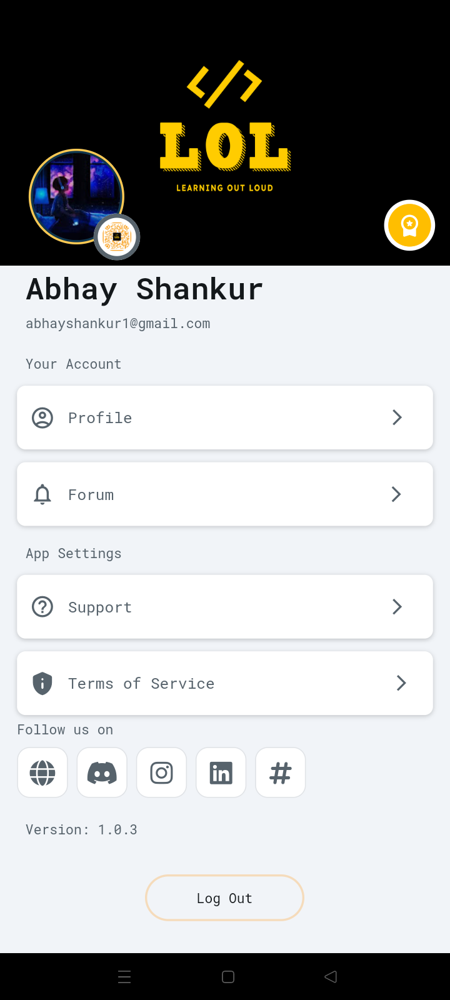

# LOL (Learn Out Loud) Coding Club Mobile Application

## Overview
The LOL Coding Club mobile application is designed to streamline the management and participation of coding club activities. This application is specifically developed for three user groups: Admin, Committee Members, and Students. It simplifies event management, attendance tracking, and information dissemination within the club. 🚀📱

## User Roles

### Admin

- 👤 Registers committee members.
- 👀 Oversees all tasks performed by committee members and students.

### Committee Members

- 📝 Create and manage their profiles.
- Primary responsibilities include:
  - **Event Creation:** 🎉 Organize and detail events.
  - **Attendance Marking:** 📲 Use an encrypted QR code unique to each student for attendance tracking. The scanner is available to committee members, while the code is on the students' app. The scanner contains the student's membership information.

### Students

- 📅 Can view upcoming events.
- 📚 Access notes and materials from previous events.
- 🎟️ Events are free for club members; non-members are required to pay for event access.
- 🏷️ Attendance is marked via a unique encrypted QR code and saved into the application, which can be downloaded anytime in the format of Excel sheets.

## Features

### Admin Features

- 🗂️ Register and manage committee members.
- 📊 Monitor activities of both committee members and students.

### Committee Member Features

- 🆔 Profile creation and management.
- Event management:
  - **Create Events:** 🗓️ Add details such as event name, date, time, and location.
  - **Attendance Tracking:** 📈 Mark attendance using a QR code scanner.
- Encrypted QR Code:
  - 🔒 Unique QR code for each student.
  - 🏷️ QR code contains membership information and is available on the student's app.
  - 📡 The scanner is available to committee members for attendance marking.
-- **Download Attendance Records:** 📥 Students can download their attendance records in Excel format.
### Student Features

- **Event Access:** 📆 View upcoming events and details.
- **Event Materials:** 📑 Access notes and materials from past events.
- **QR Code for Attendance:** 🏷️ Display unique QR code for attendance marking.
- **Membership Information:** 🏅 Displayed within the QR code.

## Technology Stack

- **Frontend:** Flutter 📱
- **Backend:** Dart 🖥️
- **Database:** Firebase 🔒
- **Authentication:** Firebase Authentication 🔐

## Future Enhancements
- 🔔 Add support for notifications and reminders for upcoming events.
- 💬 Implement a feedback system for events.
- 💬 Add a chat feature for real-time communication between members.
- 📈 Integrate analytics for event participation and member engagement.

## Installation
1. [Download Admin App](apk/app-release-admin-1_0_2.apk) 📥
2. [Download Student and Committee Members App](apk/app-release-members-1_0_3.apk) 📥
3. Install the application and create your profile. 🆔
4. All set! Enjoy. 🎉

